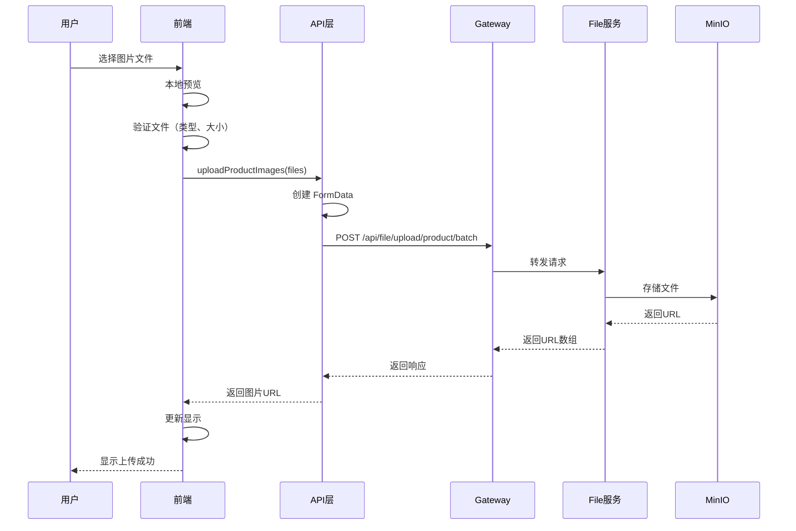

# 文件上传功能完善说明

## 更新概览

根据《前端对接文档-文件上传模块.md》，已完成实际文件上传功能的集成，替换了原有的 URL 输入方式。

## 更新内容

### 1. 新增文件 - API 封装

**文件**：`src/api/file.js`

**功能**：
- `uploadProductImage(file)` - 上传单张商品图片
- `uploadProductImages(files)` - 批量上传商品图片（最多9张）
- `uploadAvatar(file)` - 上传用户头像
- `validateImageFile(file, options)` - 文件验证工具函数

**特性**：
- 自动添加 `multipart/form-data` 请求头
- 自动携带 `satoken` 认证
- 完善的文件验证（类型、大小）

### 2. 更新文件 - 商品发布/编辑页面

**文件**：`src/views/ProductForm.vue`

**主要改动**：

#### 移除的功能
- ❌ 图片 URL 输入框
- ❌ URL 添加对话框
- ❌ 手动输入 URL 的方式

#### 新增的功能
- ✅ 文件选择器（支持多选）
- ✅ 批量图片上传
- ✅ 实时上传进度显示
- ✅ 本地图片预览
- ✅ 文件类型验证（JPG、PNG、GIF、WEBP）
- ✅ 文件大小验证（单张 5MB）
- ✅ 数量限制验证（最多 9 张）
- ✅ 上传状态可视化
- ✅ 删除已上传图片
- ✅ 上传失败自动清理

#### 用户体验改进
```
旧流程（URL输入）：
1. 点击"添加图片"
2. 弹出对话框
3. 手动输入图片URL
4. 点击"添加"
5. 图片显示（可能加载失败）

新流程（文件上传）：
1. 点击"添加图片"（+号）
2. 选择本地图片文件
3. 自动上传到服务器
4. 实时显示上传进度
5. 上传成功立即显示
```

#### 代码结构
```vue
<template>
  <!-- 已上传的图片 -->
  <div class="image-preview">...</div>
  
  <!-- 正在上传的图片（带进度条）-->
  <div class="image-preview uploading">...</div>
  
  <!-- 上传按钮 -->
  <div class="upload-placeholder" @click="triggerFileInput">+</div>
  
  <!-- 隐藏的文件输入框 -->
  <input ref="fileInput" type="file" multiple />
</template>

<script setup>
import { uploadProductImages, validateImageFile } from '@/api/file'

// 上传逻辑
const handleFileSelect = async (event) => {
  // 1. 获取文件
  // 2. 验证文件
  // 3. 创建预览
  // 4. 上传到服务器
  // 5. 更新状态
}
</script>
```

### 3. 更新文件 - 个人中心页面

**文件**：`src/views/Profile.vue`

**主要改动**：

#### 新增功能
- ✅ 头像展示区域（圆形头像，首页可见）
- ✅ 点击上传头像
- ✅ 鼠标悬停显示"点击上传"提示
- ✅ 上传中状态提示
- ✅ 文件验证（类型、大小 2MB）
- ✅ 头像预览更新
- ✅ 错误处理和降级

#### 移除的功能
- ❌ 头像 URL 输入框

#### 用户体验改进
```
旧流程：
编辑信息 → 输入头像URL → 保存 → 可能显示错误

新流程：
编辑信息 → 点击头像 → 选择文件 → 自动上传 → 实时预览 → 保存
```

#### 视觉效果
- 圆形头像展示
- 头像边框（使用主题色）
- 悬停时显示上传提示
- 上传中半透明效果
- 响应式设计

### 4. 新增文档

**文件**：`测试指南-文件上传.md`

包含：
- 完整的测试步骤
- 预期结果说明
- 常见问题排查
- 性能测试建议
- 测试检查清单

---

## 技术实现细节

### 文件上传流程



### 关键代码片段

#### 1. 批量上传实现
```javascript
export const uploadProductImages = (files) => {
  const formData = new FormData()
  
  // 所有文件使用同一个 key "files"
  files.forEach(file => {
    formData.append('files', file)
  })
  
  return request({
    url: '/api/file/upload/product/batch',
    method: 'POST',
    data: formData,
    headers: {
      'Content-Type': 'multipart/form-data'
    }
  })
}
```

#### 2. 文件验证
```javascript
export const validateImageFile = (file, options = {}) => {
  const {
    maxSize = 5, // MB
    allowedTypes = ['image/jpeg', 'image/jpg', 'image/png', 'image/gif', 'image/webp']
  } = options
  
  // 类型检查
  if (!allowedTypes.includes(file.type.toLowerCase())) {
    return { valid: false, message: '不支持的文件格式' }
  }
  
  // 大小检查
  const sizeMB = file.size / 1024 / 1024
  if (sizeMB > maxSize) {
    return { valid: false, message: `文件过大: ${sizeMB.toFixed(2)}MB` }
  }
  
  return { valid: true }
}
```

#### 3. 上传进度显示
```vue
<div class="image-preview uploading">
  
  <div class="upload-progress">
    <div class="progress-bar"></div>
    <span>上传中...</span>
  </div>
</div>

<style>
.progress-bar {
  animation: progress-animation 1.5s ease-in-out infinite;
}

@keyframes progress-animation {
  0% { width: 0%; }
  50% { width: 70%; }
  100% { width: 100%; }
}
</style>
```

#### 4. 本地预览
```javascript
// 创建本地预览URL
const preview = URL.createObjectURL(file)

// 使用完后释放内存
URL.revokeObjectURL(preview)
```

---

## 接口说明

### 1. 上传商品图片（批量）

**接口**：`POST /api/file/upload/product/batch`

**请求头**：
```
Content-Type: multipart/form-data
satoken: <token>
```

**请求体**：
```
files: [File, File, File...]  // 最多9个文件
```

**响应**：
```json
{
  "code": 200,
  "message": "上传成功",
  "data": [
    "http://localhost:9000/market-product/abc123.jpg",
    "http://localhost:9000/market-product/def456.jpg"
  ]
}
```

### 2. 上传用户头像

**接口**：`POST /api/file/upload/avatar`

**请求体**：
```
file: File  // 单个文件，最大2MB
```

**响应**：
```json
{
  "code": 200,
  "message": "上传成功",
  "data": "http://localhost:9000/market-avatar/user123.png"
}
```

---

## 图片访问说明

### MinIO 图片 URL 格式

```
http://localhost:9000/{bucket-name}/{file-name}
```

**示例**：
- 商品图片：`http://localhost:9000/market-product/abc123.jpg`
- 用户头像：`http://localhost:9000/market-avatar/user456.png`

### 为什么可以直接访问？

1. MinIO 桶设置为**公开读**权限
2. 不需要 Token 认证
3. 浏览器可以直接请求

### 在前端中使用

```vue
<!-- 方式1：img 标签 -->


<!-- 方式2：背景图 -->
<div :style="{ backgroundImage: `url(${product.coverImage})` }"></div>

<!-- 方式3：懒加载 -->


<!-- 方式4：错误降级 -->

```

---

## 文件清单

### 新增文件
```
src/
├── api/
│   └── file.js                    # 文件上传 API 封装
测试指南-文件上传.md                  # 测试文档
```

### 修改文件
```
src/
├── views/
│   ├── ProductForm.vue            # 商品发布/编辑（图片上传）
│   └── Profile.vue                # 个人中心（头像上传）
```

---

## 使用指南

### 开发者使用

#### 在其他组件中上传图片

```vue
<script setup>
import { uploadProductImages, validateImageFile } from '@/api/file'

const handleUpload = async (files) => {
  // 1. 验证文件
  for (const file of files) {
    const validation = validateImageFile(file)
    if (!validation.valid) {
      alert(validation.message)
      return
    }
  }
  
  // 2. 上传
  try {
    const res = await uploadProductImages(files)
    if (res.code === 200) {
      const urls = res.data // 图片URL数组
      console.log('上传成功:', urls)
    }
  } catch (error) {
    console.error('上传失败:', error)
  }
}
</script>
```

#### 上传单张图片

```javascript
import { uploadProductImage } from '@/api/file'

const uploadSingle = async (file) => {
  const res = await uploadProductImage(file)
  return res.data // 返回单个URL字符串
}
```

### 用户使用

#### 发布商品时上传图片
1. 进入"发布商品"页面
2. 点击"添加图片"（+号图标）
3. 选择1-9张图片
4. 等待上传完成
5. 填写其他信息并提交

#### 更换头像
1. 进入"个人中心"
2. 点击"编辑信息"
3. 在对话框中点击头像区域
4. 选择新头像图片
5. 等待上传完成
6. 点击"保存"

---

## 注意事项

### 开发环境

1. **MinIO 必须运行**
   ```bash
   docker ps | grep minio
   ```

2. **File 服务必须运行**
   端口：8106

3. **桶权限设置**
   - market-product → Public
   - market-avatar → Public

### 生产环境

1. **修改 MinIO 地址**
   当前：`http://localhost:9000`
   生产：`https://minio.yourdomain.com`

2. **CDN 加速**
   建议在 MinIO 前加 CDN

3. **图片处理**
   - 考虑添加图片压缩
   - 自动生成缩略图
   - 添加水印

4. **安全性**
   - 添加上传频率限制
   - 添加图片内容审核
   - 记录上传日志

---

## 待优化功能

### 短期优化（1周内）
- [ ] 添加上传进度百分比显示
- [ ] 支持拖拽上传
- [ ] 添加图片裁剪功能
- [ ] 优化上传失败重试逻辑

### 中期优化（1个月内）
- [ ] 图片自动压缩
- [ ] 生成多尺寸缩略图
- [ ] 添加图片编辑功能（滤镜、旋转）
- [ ] 支持粘贴上传

### 长期优化（3个月内）
- [ ] 集成图片 CDN
- [ ] 图片内容审核（鉴黄、广告识别）
- [ ] 图片版权保护（水印）
- [ ] 图片懒加载优化

---

## 常见问题

### Q1: 为什么上传后图片显示不出来？

**A**: 检查以下几点
1. MinIO 是否正在运行
2. 桶权限是否设置为 Public
3. 图片 URL 是否完整且正确
4. 浏览器控制台是否有错误

### Q2: 如何修改上传文件大小限制？

**A**: 修改验证函数的参数
```javascript
validateImageFile(file, { maxSize: 10 }) // 改为10MB
```

同时需要修改后端配置和 MinIO 限制。

### Q3: 能否上传其他格式的文件？

**A**: 当前仅支持图片格式。如需支持其他格式：
1. 修改 `accept` 属性
2. 修改 `validateImageFile` 函数
3. 后端添加相应处理

### Q4: 如何实现图片压缩？

**A**: 可以使用 `compressorjs` 或 `browser-image-compression` 库
```javascript
import imageCompression from 'browser-image-compression';

const compressedFile = await imageCompression(file, {
  maxSizeMB: 1,
  maxWidthOrHeight: 1920
});
```

---

## 版本历史

**v1.0.0** - 2026-02-15
- ✅ 实现商品图片批量上传
- ✅ 实现用户头像上传
- ✅ 文件类型和大小验证
- ✅ 上传进度显示
- ✅ 本地预览功能
- ✅ 错误处理和降级

---

**开发完成时间**：2026-02-15  
**开发人员**：GitHub Copilot  
**文档版本**：v1.0.0
